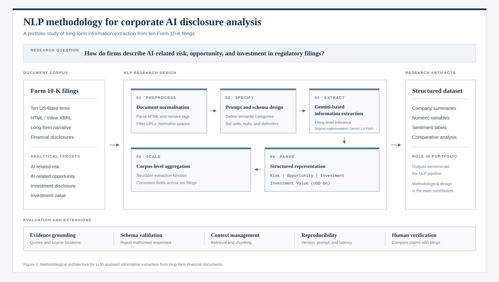

# NLP Analysis of AI Disclosures in 10-K Filings with Gemini

A structured NLP pipeline for analysing AI-related disclosures in long-form corporate filings.

## Overview

This project examines how ten major US-listed companies describe artificial intelligence in their Form 10-K filings. It converts filing HTML into normalised text, uses Gemini-based information extraction to identify relevant disclosures, and parses the generated responses into consistent company-level variables.

The analysis focuses on four fields: AI-related risk, AI-related opportunity, AI-related investment and the latest explicitly disclosed investment value in billions of US dollars. The extracted representations are subsequently used to produce a constrained Bullish, Bearish or Neutral classification of each company's positioning towards AI.

The original implementation used Gemini 2.0 Flash. The public portfolio version emphasises the underlying NLP research design rather than a particular model version or a single set of generated outputs.



## Methodology

- HTML parsing and text extraction with Beautiful Soup
- URL removal and whitespace normalisation using regular expressions
- Structured prompt design with defined semantic categories, numeric units and null handling
- Gemini-based information extraction from long-form Form 10-K text
- Rule-based parsing of qualitative sections and investment values
- Reusable corpus-level inference across ten company filings
- Aggregation of extracted fields into a company-level pandas DataFrame
- Constrained AI sentiment classification using the extracted representations
- Critical evaluation of context length, hallucination, evidence grounding and comparability

See [`nlp_10k_gemini_analysis.ipynb`](nlp_10k_gemini_analysis.ipynb) for the complete methodology and code.

## Key Results

| Evaluation item | Portfolio outcome |
|---|---:|
| Company filings processed | 10 |
| Structured fields extracted per company | 4 |
| Bullish classifications | 6 |
| Neutral classifications | 4 |
| Bearish classifications | 0 |
| Filings with an explicit investment value extracted | 2 |

The pipeline produced structured summaries for all ten filings and demonstrated how a common extraction schema can be applied across heterogeneous long-form financial documents.

The empirical values should be interpreted cautiously. Only Alphabet and Amazon produced explicit investment values in the original run, while most companies discussed AI through broader research, infrastructure or capital-expenditure language. These disclosures do not share a standard definition and are therefore not directly comparable measures of AI investment.

The main contribution of the portfolio project is methodological: it demonstrates document preprocessing, prompt specification, structured information extraction, response parsing and corpus-level aggregation. The generated classifications serve as an illustration of the pipeline rather than as definitive investment conclusions.

## Data

The ten Form 10-K HTML files were provided through the University of Melbourne course environment. The course-provided files are not included in this repository.

Users with independently obtained, authorised copies of the corresponding public filings can place them in the `data/` directory using the naming convention:

```text
data/<TICKER>_latest_10K.html
```

The expected tickers are:

```text
NVDA, GOOGL, MSFT, AMZN, META, TSLA, IBM, INTC, CRM, ORCL
```

See [`data/README.md`](data/README.md) for the complete filename list and reproducibility limitations.

## Running the Notebook

Create and activate a Python environment, then install the required packages:

```bash
python -m venv .venv
source .venv/bin/activate
pip install -r requirements.txt
```

Provide a Gemini API key through an environment variable:

```bash
export GOOGLE_GEMINI_API_KEY="your-key-here"
```

Then open the notebook:

```bash
jupyter notebook nlp_10k_gemini_analysis.ipynb
```

Never commit an API key. The included [`.env.example`](.env.example) contains a placeholder only.

## Limitations

- Full 10-K filings may exceed practical model context limits, potentially causing relevant information to be omitted.
- LLM-generated extractions may vary across runs or include claims that are not fully supported by the source text.
- The extraction framework was evaluated using a single model and was not benchmarked against alternative LLMs, limiting conclusions about cross-model robustness.
- AI investment disclosures are not standardised across companies, limiting the comparability of extracted values.
- The outputs are exploratory and should be verified against the original filings before interpretation.

## Repository Structure

```text
nlp-10k-gemini-analysis/
├── assets/
│   ├── README.md
│   └── project-overview.svg
├── data/
│   └── README.md
├── .env.example
├── .gitignore
├── README.md
├── nlp_10k_gemini_analysis.ipynb
└── requirements.txt
```

## Academic Context

This repository is a public portfolio adaptation of graduate coursework completed in *Applied Machine Learning in Finance* at the University of Melbourne. It has been reorganised and revised for public presentation.

The methodology figure was created specifically for the public portfolio adaptation and was not part of the original coursework content.
